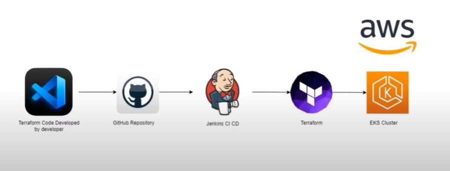

# Deploying an EKS Cluster with Terraform and Jenkins

### Architecture


### Tools used: Terraform, Jenkins, AWS EKS, AWS CLI, VsCode, AWS IAM, AWS EC2, AWS S3

<a href="https://code.visualstudio.com/">
  
</a>
<a href="https://aws.amazon.com">
  
</a>
<a href="https://www.kernel.org">
  
</a>
<a href="https://git-scm.com">
  
</a>
<a href="https://github.com">
  
</a>
<a href="https://www.jenkins.io">
  
</a>
<a href="https://www.terraform.io">
  
</a>
<a href="https://www.svgrepo.com/show/373924/nginx.svg">
  
</a>

<a href="https://aws.amazon.com/ec2/">
  
</a>

<a href="https://aws.amazon.com/elasticloadbalancing/">
  
</a>

<a href="https://aws.amazon.com/eks/">
  
</a>

<a href="https://aws.amazon.com/iam/">
  
</a>

<a href="https://aws.amazon.com/vpc/">
  
</a>

<a href="https://aws.amazon.com/s3/">
  
</a>

---

## Overview
This project demonstrates how to deploy an Amazon EKS cluster using Terraform and Jenkins. The workflow includes creating the necessary infrastructure, configuring a CI/CD pipeline, and deploying a sample application to the EKS cluster.

---

## Prerequisites
Ensure the following tools and configurations are in place before starting:
1. **Terraform** installed on the system.
2. **Kubernetes CLI (kubectl)** installed and configured.
3. **AWS account** with appropriate permissions.
4. **AWS CLI** installed and configured with access credentials.
5. An **IAM user** with Access Key and Secret Key for managing AWS resources.

---

## Steps to Deploy

### 1. Create an EC2 Instance with Jenkins
- Launch an EC2 instance on AWS.
- Install and configure Jenkins on the instance for CI/CD pipeline management.

### 2. Write Terraform Code for EKS Cluster
- Develop Terraform scripts to provision an EKS cluster and required resources.
- Save the code in a directory structure (e.g., `EKS-Cluster`).

### 3. Push the Code to GitHub
- Initialize a Git repository.
- Add and commit the Jenkins setup code and Terraform code for EKS cluster deployment:
  ```bash
  git add .
  git commit -m "push code to github"
  git push origin -u feature
  ```
- Create a pull request from the `feature` branch to the `main` branch and merge it.

### 4. Configure Jenkins for the CI/CD Pipeline
- Add AWS credentials to the Jenkins dashboard:
  1. Go to **Manage Jenkins > Credentials > Global > Add Credentials**.
  2. Add two **Secret Text** credentials:
     - **ID**: `AWS_ACCESS_KEY_ID`, **Secret**: `<your-access-key>`, **Description**: `Access Key`
     - **ID**: `AWS_SECRET_ACCESS_KEY`, **Secret**: `<your-secret-key>`, **Description**: `Secret Key`
- Create a Jenkins pipeline named `eks-cicd`.

### 5. Create and Configure the Jenkins Pipeline
Add the following pipeline script in the **Pipeline** section of the Jenkins project:

```groovy
pipeline {
  agent any
  environment {
    AWS_ACCESS_KEY_ID = credentials('AWS_ACCESS_KEY_ID')
    AWS_SECRET_ACCESS_KEY = credentials('AWS_SECRET_ACCESS_KEY')
    AWS_DEFAULT_REGION = "us-east-1"
  }
  stages {
    stage('Checkout SCM') {
      steps {
        script {
          checkout scmGit(branches: [[name: '*/main']], extensions: [], userRemoteConfigs: [[url: 'https://github.com/username/repository-name.git']])
        }
      }
    }
    stage('Initializing Terraform') {
      steps {
        script {
          dir('EKS-Cluster') {
            sh 'terraform init'
          }
        }
      }
    }
    stage('Formatting Terraform') {
      steps {
        script {
          dir('EKS-Cluster') {
            sh 'terraform fmt'
          }
        }
      }
    }
    stage('Validating Terraform') {
      steps {
        script {
          dir('EKS-Cluster') {
            sh 'terraform validate'
          }
        }
      }
    }
    stage('Dry-Run Terraform (Plan)') {
      steps {
        script {
          dir('EKS-Cluster') {
            sh 'terraform plan'
          }
          input(message: "Are you sure to proceed?", ok: "Proceed")
        }
      }
    }
    stage('Creating/Destroying EKS Cluster') {
      steps {
        script {
          dir('EKS-Cluster') {
            sh 'terraform $action --auto-approve'
          }
        }
      }
    }
    stage('Deploying Nginx Application') {
      steps {
        script {
          dir('EKS-Cluster/Configuration-files') {
            sh 'aws eks update-kubeconfig --name my-eks-cluster'
            sh 'kubectl apply -f deployment.yaml'
            sh 'kubectl apply -f service.yaml'
          }
        }
      }
    }
  }
  parameters {
    choice(name: 'action', choices: ['apply', 'destroy'], description: 'Action to be performed by Terraform')
  }
}
```

---

### 6. Deployment Configuration Files
Create the following Kubernetes manifests in the `EKS-Cluster/Configuration-files` directory:

#### `deployment.yaml`
```yaml
apiVersion: apps/v1
kind: Deployment
metadata:
  name: nginx-deployment
spec:
  replicas: 2
  selector:
    matchLabels:
      app: nginx
  template:
    metadata:
      labels:
        app: nginx
    spec:
      containers:
      - name: nginx
        image: nginx:latest
        ports:
        - containerPort: 80
```

#### `service.yaml`
```yaml
apiVersion: v1
kind: Service
metadata:
  name: nginx-service
spec:
  selector:
    app: nginx
  ports:
    - protocol: TCP
      port: 80
      targetPort: 80
  type: LoadBalancer
```

---

## Additional Configuration
### Jenkins Polling for SCM Updates
To automatically trigger builds on GitHub updates:
1. Go to **Build Triggers** in the Jenkins project.
2. Select **Poll SCM** and set the schedule:
   ```plaintext
   * * * * *
   ```

---

## Conclusion
This setup ensures a robust CI/CD pipeline for deploying and managing EKS clusters and Kubernetes applications using Terraform and Jenkins. Use Jenkins parameters to easily apply or destroy the infrastructure.

## References

- [AMI Data Source Filter](https://registry.terraform.io/providers/hashicorp/aws/4.53.0/docs/data-sources/ami.html)
- [AWS EKS Module](https://registry.terraform.io/modules/terraform-aws-modules/eks/aws/latest)
- [AWS EC2 Module](https://registry.terraform.io/modules/terraform-aws-modules/ec2-instance/aws/latest)
- [AWS VPC Module](https://registry.terraform.io/modules/terraform-aws-modules/vpc/aws/latest)
- [Security Group Module](https://registry.terraform.io/modules/terraform-aws-modules/security-group/aws/latest)
- [Jenkins Installation](https://www.jenkins.io/doc/book/installing/linux/)
- [kubectl Installation](https://kubernetes.io/docs/tasks/tools/install-kubectl-linux/)
```
